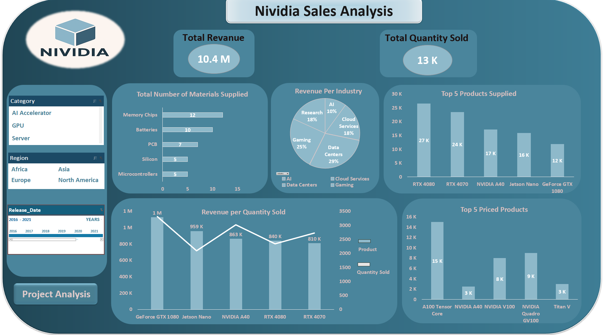
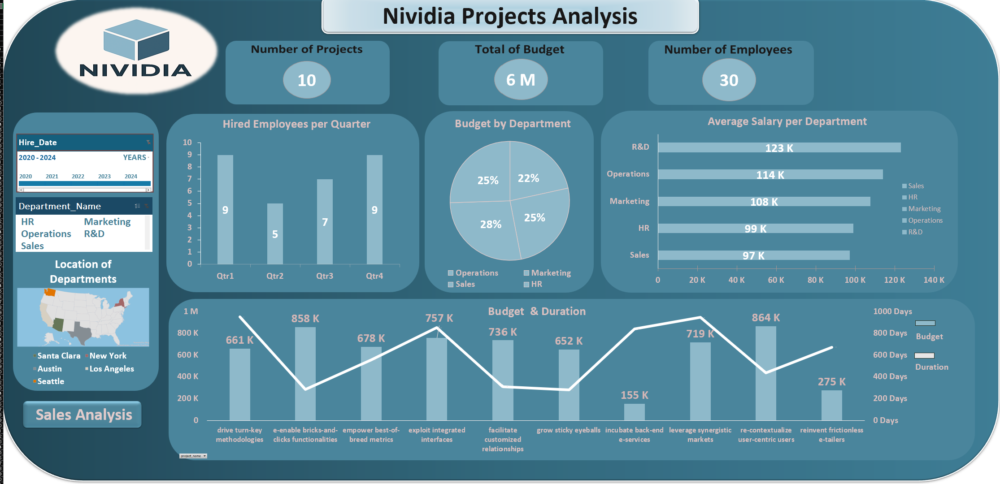

# NVIDIA Excel Dashboard Analysis

## Overview

This project is an interactive Excel dashboard created to analyze NVIDIA sales and project data.

The project was built using Power Query for data cleaning and preparation, Power Pivot for data modeling, and Pivot Tables and Pivot Charts for analysis and visualization.

The dashboards provide an interactive way to explore sales performance and project-related insights through KPIs, charts, and slicers.

---

## Sales Dashboard

### Features

* Total Revenue KPI
* Total Quantity Sold KPI
* Revenue by Industry
* Top 5 Products Supplied
* Top 5 Priced Products
* Revenue vs Quantity Sold Analysis
* Interactive Filters using Slicers

---

## Project Dashboard

### Features

* Total Budget KPI
* Number of Projects KPI
* Number of Employees KPI
* Budget by Department
* Average Salary by Department
* Hired Employees per Quarter
* Budget vs Project Duration Analysis
* Interactive Filters using Slicers

---

## Tools Used

* Microsoft Excel
* Power Query
* Power Pivot
* Pivot Tables
* Pivot Charts
* Slicers
* KPI Cards

---

## What I Learned

Through this project, I practiced:

* Data cleaning and transformation using Power Query
* Creating relationships between tables using Power Pivot
* Building Pivot Tables and Pivot Charts
* Designing interactive dashboards
* Creating KPI-based reports
* Presenting data visually for easier analysis

---

## Dashboard Preview

### Sales Dashboard

### Projects Dashboard

---

## Author

Hnan Alzahrani
